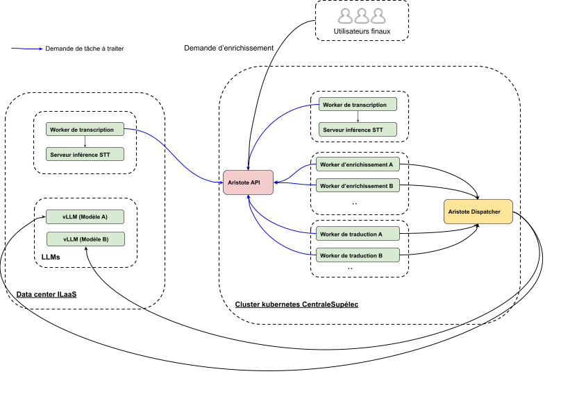

# Aristote Transcription Worker

**Aristote Transcription Worker** is a Python-based middleware that connects [AristoteAPI](https://stt.ilaas.fr/api/doc) with a Speech-to-Text (STT) server to automate audio transcription tasks. It supports both scheduled and one-time execution modes and is compatible with OpenAI Whisper-style servers.

This worker is part of a distributed architecture that includes multiple task-specific workers (transcription, enrichment, translation), orchestrated through [AristoteAPI](https://stt.ilaas.fr/api/doc).


---

## 🚀 Features

- Periodic or one-time job execution
- Works with any OpenAI-compatible STT server
- Lightweight containerized setup for both CPU and GPU
- Automatic model preloading for transcription

---

## 📦 Usage

### 1. Environment Variables

Copy the example environment file and update it with your configuration:

```bash
cp -f .env.dist .env
```

Update `.env` with:

| Variable | Description |
|----------|-------------|
| `ARISTOTE_API_BASE_URL` | Base URL of the AristoteAPI |
| `ARISTOTE_API_CLIENT_ID` | Client ID |
| `ARISTOTE_API_CLIENT_SECRET` | Client secret |
| `STT_BASE_URL` | Base URL of the STT server (default is `http://speaches:3000`) |
| `CRON_SCHEDULE` | Optional. Cron expression to schedule the worker (e.g. `*/5 * * * *`) |
| `MAX_LOG_DAYS` | Max number of days to retain logs in the `/logs` folder |
| `MODEL` | ID of the STT model to load |

🔍 To see available models on the local STT server, check:
[http://localhost:8000/v1/registry](http://localhost:8000/v1/registry)

---

### 2. Worker Modes

- **One-time execution**:  
  If `CRON_SCHEDULE` is **not set**, the worker runs once and exits after processing.

- **Scheduled execution**:  
  If `CRON_SCHEDULE` **is set**, the worker runs periodically based on the cron expression.

---

## 🐳 Docker Setup

Two `docker-compose` configurations are available:

### CPU Setup

```bash
docker-compose up
```

### GPU Setup

```bash
docker-compose -f docker-compose.gpu.yaml up
```

### Included Containers

| Container | Description |
|----------|-------------|
| `transcription-worker` | Fetches transcription jobs from AristoteAPI and sends audio to the STT server then sends the transcription back to AristoteAPI|
| `speaches` | Local Speech-to-Text server compatible with OpenAI API |
| `speaches-load-model` | Waits for `speaches` to be ready and loads the specified model |

---

## 📂 Logs

Logs are stored in the `logs/` directory and are automatically cleaned based on the `MAX_LOG_DAYS` setting.
